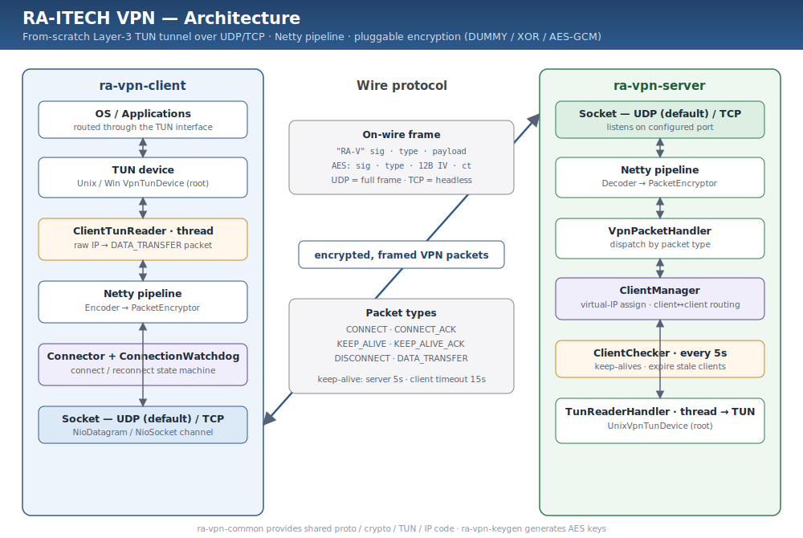

# RA-ITECH VPN
A simple VPN protocol implementation in JAVA

## Key features
- UDP and TCP protocols support
- AES encryption

## Architecture


A TUN-based Layer-3 tunnel bridges a dedicated TUN reader thread with a Netty channel pipeline
in both directions. The client wraps raw IP packets as `DATA_TRANSFER` VPN packets and the server
routes them between clients or onto its own TUN device, while keep-alives drive connection
liveness and reconnection. See [CLAUDE.md](CLAUDE.md) for a full breakdown.

## Build
```bash
  mvn clean package
```

## Modules
### ra-vpn-server
VPN server
#### Running server
UDP is default protocol
```bash
    mvn clean package
    java -jar target/ra-vpn-server.jar -p 9867 -e AES -k ./key.txt
```
For using TCP, use `-t` option
```bash
    java -jar target/ra-vpn-server.jar -p 9867 -e AES -k ./key.txt -t
```

#### Command line options
| Option | Description | Default |
|--------|-------------|---------|
| `-h, --host` | Host address to listen on | 0.0.0.0 |
| `-p, --port` | Port to listen on | Required |
| `-n, --tun-number` | TUN device number (e.g. 21 becomes utun21) | 21 |
| `-c, --network-cidr` | VPN network CIDR (server virtual IP and subnet) | 10.10.0.1/24 |
| `-e, --encryptor` | Encryption type (DUMMY, XOR, AES) | DUMMY |
| `-k, --key-file` | Path to cipher key file (required for AES) | - |
| `-t, --tcp` | Use TCP transport instead of UDP | false |
| `-l, --log-level` | Log level (TRACE, DEBUG, INFO, WARN, ERROR) | INFO |

#### Linux service automation with systemd
Generate AES encryption key with `java -jar target/ra-vpn-keygen.jar`.
Then copy ra-vpn-server jar file and key to `/opt/ra-vpn`
Create file ra-vpn-server.service in `/etc/systemd/system`
```ini
[Unit]
Description=RA-ITech VPN Server
After=network.target

[Service]
ExecStart=/usr/bin/java -jar /opt/ra-vpn/ra-vpn-server.jar -p 9867 -e AES -k /opt/ra-vpn/key.txt
Restart=always
Type=exec

[Install]
WantedBy=default.target
```
Then execute
```bash
    sudo systemctl daemon-reload
    sudo systemctl enable ra-vpn-server.service
    sudo systemctl start ra-vpn-server.service
```

### ra-vpn-client
VPN client

#### Running client
UDP is default protocol
```bash
    java -jar target/ra-vpn-client.jar -h <server-host> -p <server-port> -e AES -k ./key.txt
```
For using TCP, use `-t` option
```bash
    java -jar target/ra-vpn-client.jar -h <server-host> -p <server-port> -e AES -k ./key.txt -t
```

#### Command line options
| Option | Description | Default |
|--------|-------------|---------|
| `-h, --host` | Server host to connect to | Required |
| `-p, --port` | Server port to connect to | Required |
| `-n, --tun-number` | TUN device number | 21 |
| `-e, --encryptor` | Encryption type (DUMMY, XOR, AES) | DUMMY |
| `-k, --key-file` | Path to cipher key file (required for AES) | - |
| `-i, --virtual-ip` | Virtual IP address | 10.10.0.10 |
| `-d, --client-id` | Client identifier | test-client |
| `-t, --tcp` | Use TCP transport instead of UDP | false |
| `-l, --log-level` | Log level (TRACE, DEBUG, INFO, WARN, ERROR) | INFO |

#### Linux service automation with systemd
Copy ra-vpn-client jar file and key to `/opt/ra-vpn`
Create file ra-vpn-client.service in `/etc/systemd/system`
```ini
[Unit]
Description=RA-ITech VPN Client
After=network.target

[Service]
ExecStart=/usr/bin/java -jar /opt/ra-vpn/ra-vpn-client.jar -h <server-host> -p 9867 -e AES -k /opt/ra-vpn/key.txt
Restart=always
Type=exec

[Install]
WantedBy=default.target
```
Then execute
```bash
    sudo systemctl daemon-reload
    sudo systemctl enable ra-vpn-client.service
    sudo systemctl start ra-vpn-client.service
```

### ra-vpn-common
Common classes for server and client

### ra-vpn-keygen
Encryption keys generator
```bash
    java -jar target/ra-vpn-keygen.jar
```